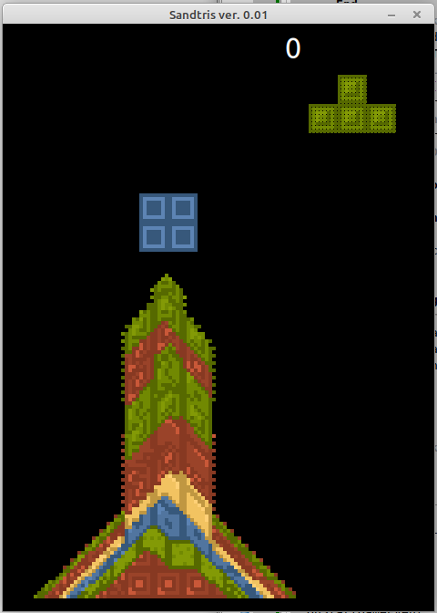

# Sandtris, TETRIS Clone with sand simulation engine

Inspired by this youtube video https://www.youtube.com/shorts/aaCWkot8mIU i wanted to have my own TETRIS clone with this special touch ;).

Implemented Features:
 - 4 Colors
 - 7 different pieces
 - Highscore calculations (only shown not stored)

This program still has lots of ways to be improved but is playable and brings joy *g*.

## What needs to be done to compile the game:

- Install LazOpenGLContext package into Lazarus IDE.
- Download dglOpenGL.pas from here ( https://github.com/saschawillems/dglopengl )
- on some Linux systems you may need a : sudo apt-get install freeglut3-dev   

License

See the license.md file located at https://github.com/PascalCorpsman/Software_Licenses/blob/main/license.md for details about the license.
